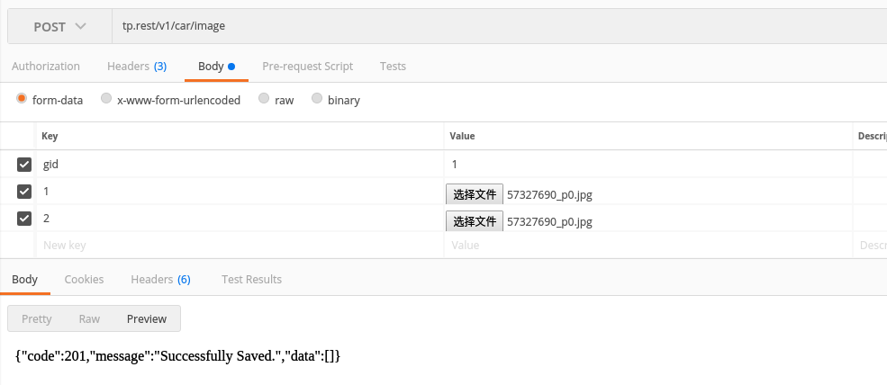

# Thinkphp5.1 Rest API - For smart car

#### 备注：本项目由[Leslin/thinkphp5-restfulapi](https://github.com/Leslin/thinkphp5-restfulapi) 修改定制化而成，另有[postman样例文档](https://documenter.getpostman.com/view/3908260/RWTspEnt)可供参考
##### 修改部分
- 验证部分的mobile手机号码修改为carid车牌号
- Trait 中的 Send辅助函数添加了header默认值为`['Content-Type' => 'application/json']`,便于返回结果格式化json
- 在Oauth控制器中生成签名前主动去掉了`'appid', 'carid', 'nonce', 'timestamp'` 以外的所有键值
##### 命令行创建api
- 命令行 ：`php think make:controller api/v1/Goods`
- 之后记得修改生成的控制器的扩展类型为Api，保证token认证
- 修改路由，注册一个资源路由：在route.php加入下面一行代码： `Route::resource(':version/goods','api/:version.Goods');`

# 目录
- [用户认证](#用户认证使用流程)
    - [1. 获取token](#1-获取认证token)
    - [2. 认证实例](#2-使用获取的token进行请求任意请求都需携带)
- [功能接口](#具体功能接口)
    - [1. 上传数据](#1上传一维数据信息)
    - [2. 上传图像](#2上传图像数据文件信息)
    - [3. 获取数据/图像](#3-获取数据)
    - [4. 获取用户/智能车](#4-获取用户列表智能车列表)
    - [5. 删除数据](#5-删除数据)

------------
### 用户认证使用流程
#### 1. 获取认证token
##### 请求地址`{SERVER}/v1/token`
##### 请求方式`POST`
##### 请求参数
- header头部信息

    |字段|是否必须|数值|备注|
    |:---:|:---:|:---:|---|
    |Content-Type|是|application/json|请求参数的类型

- Post内容参数

    |字段|是否必须|数值|备注|
    |:---:|:---:|:---:|---|
    |appid|是|tp5restfultest|请求的应用id
    |carid|是|(例如A22232)|以不同车牌号标记不同智能车
    |nonce|是|随机数|用于生成token
    |timestamp|是|当前时间戳(取高10位)|用于生成token以及确认过期时间
    |sign|是|MD5签名值|根据url参数进行MD5加密后的签名<br>例如:`appid=tp5restfultest&carid=A22232&nonce=2&timestamp=1534649748&key=123456`<br>进行加密后的MD5值:`2e90aad66c2248c1ca1b7a1d7906249b`<br>其中key的值为请求的应用id对应的appsecret，由用户定义存储在数据库中

##### 请求样例
- 请求地址 `/v1/token`
- 请求方式 `POST`
- header参数`Content-Type: application/json`
- body请求参数(已知用户appsecret=123456)
    ```json
    {
        "appid" : "tp5restfultest",
        "carid" : "A22232",
        "nonce": "2",
        "timestamp": 1534649748,
        "sign": "2e90aad66c2248c1ca1b7a1d7906249b",
        "sdasd": "Asdasd"
    }
    ```
 - 返回结果
    - access_token为访问令牌
    - expires_time为过期时间默认为当前时间往后两个小时
    - refresh_token为刷新令牌
    - refresh_expires_time为刷新令牌的过期时间默认为当前时间往后一个月
    ```json
    {
        "code": 200,
        "message": "success",
        "data": {
            "access_token": "1p9tjKs3NMDSghmV88PB27IaQZ7U1w66",
            "expires_time": 1534663312,
            "refresh_token": "fmUh89LrwylMd2678ePEciDtYo5Cs7V9",
            "refresh_expires_time": 1537248112,
            "client": {
                "uid": 6,
                "carid": "A22232",
                "appid": "tp5restfultest",
                "nonce": "2",
                "timestamp": 1534649748,
                "sign": "2e90aad66c2248c1ca1b7a1d7906249b",
                "sdasd": "Asdasd",
                "version": "v1"
            }
        }
    }
    ```

#### 2. 使用获取的token进行请求(任意请求都需携带)
##### 请求方式 任意
##### 请求参数
- header头部信息

    |字段|是否必须|数值|备注|
    |:---:|:---:|:---:|---|
    |authentication|是|`userid`+空格+base64编码加密后数值|其中加密的数值形式为`$appid:$access_token:$uid`

##### 请求样例
- 请求地址 `{SEVER}/v1/address/2`
- 请求方式 `GET`
- 请求参数
    - header参数<br>
        ```
        authentication: userid dHA1cmVzdGZ1bHRlc3Q6V0FmZU9KaGRNanQ2MkVTQ29yazN5ejVtcDNpUjFGdzI6NA==
        ```
        其中base64数值来源是`tp5restfultest:WAfeOJhdMjt62ESCork3yz5mp3iR1Fw2:4`
        - tp5restfultest =>appid
        - WAfeOJhdMjt62ESCork3yz5mp3iR1Fw2 => access_token
        - 4 => uid
- 返回结果
    ```
    address-2
    ```
##### <font color="red">注意</font>
  值得注意的是，对于uid和appid没有进行二次认证，默认是约定俗成(在客户端获取token的时候获取到的uid应当由客户端自己保留并编码以生成之后的请求认证)，这里和token仪器加入base64编码应该是为了避免token在传输过程中被明文获取，提高安全性


-----------
### 具体功能接口
#### 1.上传一维数据信息
##### 请求地址 `{SEVER}/v1/car/data`
##### 请求方式 `POST`

##### 请求参数
- 头部信息

   |字段|是否必须|数值|备注|
   |:---:|:---:|:---:|---|
   |authentication|是|`userid`+空格+base64编码加密后数值|其中加密的数值形式为`$appid:$access_token:$uid`|
   |Content-Type|是|application/json|指明传递参数类型
- 请求体内容信息
参考形式如下
    - `gid` => 分组信息，每15ms提交的数据包自增1，也就是从1开始往后每发送一次递增1
    - `list`内容的键值 => 为逐渐递增的数字，确定数据顺序
    - `ccd` => CCD 数组
    - `electric` => 电感感应值
    - `acceleration` => 加速度值
    - `speed` => 速度编码值
    ```json
    {
    	"gid": {{gid}},
    	"computed": {{$randomInt}},
    	"list": {
    		"1": {
    		"ccd": {{$randomInt}},
    		"electric": {{$randomInt}},
    		"acceleration": {{$randomInt}},
    		"speed": {{$randomInt}}
    		},
    		"2": {
    			"ccd": {{$randomInt}},
    			"electric": {{$randomInt}},
    			"acceleration": {{$randomInt}},
    			"speed": {{$randomInt}}
    		},
    		"3": {
    			"ccd": {{$randomInt}},
    			"electric": {{$randomInt}},
    			"acceleration": {{$randomInt}},
    			"speed": {{$randomInt}}
    		},
    		"4": {
    			"ccd": {{$randomInt}},
    			"electric": {{$randomInt}},
    			"acceleration": {{$randomInt}},
    			"speed": {{$randomInt}}
    		},
    		"5": {
    			"ccd": {{$randomInt}},
    			"electric": {{$randomInt}},
    			"acceleration": {{$randomInt}},
    			"speed": {{$randomInt}}
    		},
    		"6": {
    			"ccd": {{$randomInt}},
    			"electric": {{$randomInt}},
    			"acceleration": {{$randomInt}},
    			"speed": {{$randomInt}}
    		},
    		"7": {
    			"ccd": {{$randomInt}},
    			"electric": {{$randomInt}},
    			"acceleration": {{$randomInt}},
    			"speed": {{$randomInt}}
    		},
    		"8": {
    			"ccd": {{$randomInt}},
    			"electric": {{$randomInt}},
    			"acceleration": {{$randomInt}},
    			"speed": {{$randomInt}}
    		}
    	}
    }
    ```
    //下次提交的时候gid就该变为2，然后下面内容的键值则是重头算起
    返回数据
    ```json
    {"code":201,"message":"Successfully Saved.","data":[]}
    ```

#### 2.上传图像数据文件信息
##### 请求地址 `{SEVER}/v1/car/image`
##### 请求方式 `POST`

##### 请求参数
- 头部信息

   |字段|是否必须|数值|备注|
   |:---:|:---:|:---:|---|
   |authentication|是|`userid`+空格+base64编码加密后数值|其中加密的数值形式为`$appid:$access_token:$uid`|
   |Content-Type|是|multipart/form-data|指明传递参数类型
- 请求体内容信息
  采用form-data的形式组织传递参数
    - gid => 分组信息，与一维数据相同，逐次递增
    - 数字1~.. => 表示该分组的图像包，对应的value即为图像文件
  如下面的例子
  
  
##### <font color="red">注意</font>
  每一个周期发送的数据需要同时传给一维数据接口以及该图像接口
  
  
#### 3. 获取数据
##### 请求地址 `{SEVER}/v1/car/{type}`
##### 请求方式 `GET`
##### 请求参数
- 头部参数

   |字段|是否必须|数值|备注|
   |:---:|:---:|:---:|---|
   |authentication|是|`userid`+空格+base64编码加密后数值|其中加密的数值形式为`$appid:$access_token:$uid`|

- url参数

   |字段|是否必须|数值|备注|
   |:---:|:---:|:---:|---|
   |type|是|image/data|获取图像或者一维数据

- 请求参数(附带在url问号后的GET参数)

   |字段|是否必须|数值|备注|
   |:---:|:---:|:---:|---|
   |uid|否|用户(车辆)id|获取具体某车的数据
   |gid|否|数据包分组信息|获取具体某个分组的数据
   |g_sid|否|符合序列号的数据包|获取分组下某序列号的数据
   |page|否|结果数据的页数|从1开始计数，默认1
   |limit|否|结果数据每页的数量|默认10
   
##### 请求样例
- 请求方式 `GET`
- 请求地址 `v1/car/image?uid=5&page=9&limit=3`
- 返回结果
    ```json
    {
        "code": 200,
        "message": "Get image Successfully.",
        "data": {
            "total": 26,
            "page": "9",
            "page_size": "3",
            "list": [
                {
                    "uid": 5,
                    "gid": 1,
                    "g_sid": 2,
                    "url": "/images_upload/5_1_2_1534669722",
                    "created": "2018-08-19 17:08:42"
                },
                {
                    "uid": 5,
                    "gid": 1,
                    "g_sid": 2,
                    "url": "/images_upload/5_1_2_1534670073",
                    "created": "2018-08-19 17:14:33"
                }
            ]
        }
    }
    ```
    
#### 4. 获取用户列表(智能车列表)
##### 请求地址 `{SEVER}/v1/user`
##### 请求方式 `GET`
##### 请求参数
- 头部参数

   |字段|是否必须|数值|备注|
   |:---:|:---:|:---:|---|
   |authentication|是|`userid`+空格+base64编码加密后数值|其中加密的数值形式为`$appid:$access_token:$uid`|

- 请求参数(附带在url问号后的GET参数)

   |字段|是否必须|数值|备注|
   |:---:|:---:|:---:|---|
   |uid|否|用户(车辆)id|获取具体某车的数据
   |page|否|结果数据的页数|从1开始计数，默认1
   |limit|否|结果数据每页的数量|默认10
   
##### 请求样例
- 请求方式 `GET`
- 请求地址 `v1/user`
- 返回结果
  `appid` 表示智能车注册的应用id，在本项目中统一只有`tp5restfultest`
    ```json
    {
        "code": 200,
        "message": "Get Data Successfully.",
        "data": {
            "total": 1,
            "page": 1,
            "page_size": 10,
            "list": [
                {
                    "uid": 1,
                    "carid": "A22232",
                    "appid": "tp5restfultest"
                }
            ]
        }
    }
    ```
    
    
#### 5. 删除数据
##### 请求地址 `{SERVER}/v1/car/{type}/{uid}`
##### 请求方式 `DELETE`
##### 请求参数
- 头部参数
    
    |字段|是否必须|数值|备注|
    |:---:|:---:|:---:|---|
    |authentication|是|`userid`+空格+base64编码加密后数值|其中加密的数值形式为`$appid:$access_token:$uid`|
    
- url参数

    |字段|是否必须|数值|备注|
    |:---:|:---:|:---:|---|
    |type|是|data/image|确定需要删除的数据类型
    |uid|是|用户uid或者`all`|确定删除的车号uid或者全部删除
    
##### 请求样例
###### 删除图片
- 请求地址 `v1/car/image/all`
- 请求方式 `DELETE`
- 无返回数据，返回头部状态码为204
###### 删除5号车的数据
- 请求地址 `v1/car/data/5`
- 请求方式 `DELETE`
- 无返回数据，返回头部状态码为204